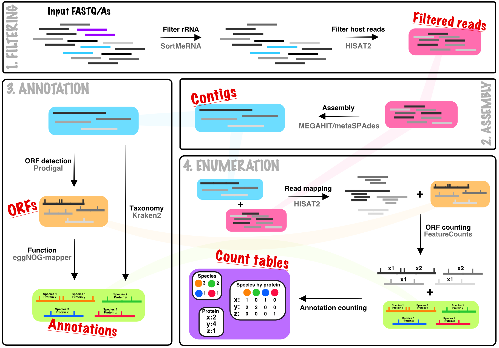

<p align="center">

</p>
<br>

#### A pipeline for taxonomic/functional annotation and quantification of metagenomic sequencing data.

MetaSequencing takes a partial assembly approach to processing metagenomic data, assembling short-reads to contigs that are used for taxonomic annotation and de novo open-reading frame detection and functional annotation. This provides a trade-off between short-read only methods and full metagenomic genome assembly, conceptually increasing taxonomic assignment accuracy by using longer contigs whilst negating the need to deal with binning and associated issues as when trying to reconstruct full genomes. This also enables quantification of function at the per taxon level.

The pipeline can be installed into isolated Conda environments using the attached install script and full metagenomic processing can be run on FASTA/FASTQ files using a single command, generating summary reports alongside processed data tables. MetaSequencing is built using the [SnakeMake](https://snakemake.readthedocs.io/en/stable/) workflow management system. A previous version of the pipeline based on the [CGAT](https://github.com/cgat-developers/cgat-core) workflow is available [here](https://github.com/microbialman/CGATMetaSequencing) but lacks some improvements made in this version and is no longer actively developed.

*Note: The complete pipeline has been tested in-house but no formal benchmarking is currently available. However, each of the individual approaches wrapped by the pipeline have been published and applied previously. Hopefully some formal testing will be done soon!*

## Pipeline overview

When executed in a folder containing single or paired-end FASTA/Q files for each sample in an experiment, by default, the pipeline will run all of the steps outlined below on a per sample basis. It will then collate the per sample counts into experiment-wide tables. Each of the four sub-stages (Filtering, Assembly, Annotation, and Enumeration) can also be run independently if only specific intermediates are required (see [Running MetaSequencing](#running)).

<p align="center">

</p>

## Install

MetaSequencing and its dependencies are best installed and run within a self-contained Conda environment.
Following the instructions below will create the necessary environments and install all dependencies.
This assumes an existing working install of [Conda](https://docs.conda.io/projects/conda/en/latest/user-guide/install/).

```bash
#clone this repository into the folder where you would like the install
git clone https://github.com/microbialman/MetaSequencing.git
cd MetaSequencing
#install of the main metasequencing environment may take several minutes as it solves
sh install.sh
```

*Note: This will generate two conda environments (some tools require Python 2 in place of 3). If you are manually installing MetaSequencing to environments without the default names you will also need to edit the calls that load the Python 2 environment in the config .yaml files as needed*

## <a name="running"></a>Running MetaSequencing

### Full pipeline

To run the full pipeline, place all the sample files in a single folder. There should be a single file or pair of files (for paired end sequencing) per sample. Paired end files should have the format *SampleName.1.fastq* *SampleName.2.fastq*. Input files can also be gzip compressed (.gz extension).

#### Configuration

Parameters can be changed in the *.yaml* files in the config directory. There are independent configuration files for each of the main stages of the pipeline. These can be used to set parameters including the reference databases used, select features to count in the enumeration step, and the threads and memory to allocate to each stage.

Altering the config directory files will make the changes global for all MetaSequencing runs. If you wish to set parameters for an individual run you can create a copy of the file and specify it with `--configfile` in the call to Snakemake, this will override the default parameters.

#### Running

Prior to running, ensure the MetaSequencing Conda environment is active.

```bash
conda activate metasequencing
```

Then, from the directory containing the files to be analysed, the pipeline can be called as follows:

```bash
snakemake -s /path/to/install/MetaSequencing.smk
```

Additional arguments to the snakemake workflow can be found in the [Snakemake](https://snakemake.readthedocs.io/en/stable/executing/cli.html) documentation. Useful additions to consider are highlighted below:

```bash
#this will do a dry run of the pipeline and just show what jobs will be executed without submitting them
snakemake -s /path/to/install/MetaSequencing.smk -n

#this will submit the jobs to a compute cluster based on a profile for the Slurm queue system, limiting to 40 concurrent jobs
#this is recommended given the size of metagenomic jobs, see Snakemake docs for more info on profiles for different systems
snakemake -s /path/to/install/MetaSequencing.smk --profile slurm -j 40
```

#### Output

Each stage will output into Filtering, Assembly, Annotation, and Enumeration folders. These will contain the filtered reads, contigs, annotation files and counts tables respectively. Within each folder there will also be a report html file with plots that provide an overview of the data. These can be combined into a single report that also summarises the Snakemake jobs by running the following command:

```bash
 snakemake -s /path/to/install/MetaSequencing.smk --report report.html
```

The counts tables at the various taxonomic levels are summed counts of reads mapping to open reading frames annotated to each taxon. Similarly the predicted protein names represent direct counts of how many reads map to ORFs assigned to that protein name. Other functional annotations, such as KEGG Pathways, can have multiple mappings (each ORF can have multiple pathway annotations), the default in this case is that the read counts assigned to each ORF are split evenly across all of the annotations. An alternative approach to handle multiple annotations is to use [set enrichment](#enrich) with the *.gmt* files produced by the pipeline.

### Individual steps

Each step can also be run individually. This can be done by editing the *global.yaml* file to specify which stage to run.
The pipeline is then run as before on a folder containing the FASTA/Q files for processing. E.g. the annotation step is run in a folder containing the contig files to be annotated, the enumeration step in a folder of reads to be mapped.

Some additional parameters may need to be set when running steps in isolation, for example specifying the contigs and annotations for the enumeration step, these are detailed in the config files as necessary.

## <a name="enrich"></a>Enrichment approach to analysing annotations

As it is not clear that splitting counts across multi-mapping annotations is an appropriate method to enumerate functions, the pipeline also provides methods for set enrichment analysis. Files are generated that map predicted protein names to all of the pathways/other annotations that they are assigned to. These files can then be used on the predicted protein name counts to carry out set enrichment analyses as commonly done for RNA-Seq datasets. We also provide these mappings between taxonomic levels so that taxonomic enrichments can be similarly tested, e.g enrichment of higher taxonomic levels can be tested from species level association results.

These *.gmt* files can be found in the *Annotation/gmt_files.dir* and *Annotation/taxon_gmt_files.dir* folders. Once association measures have been established with base-level annotations such as species and predicted protein names, the effect sizes/p-values can then be used to test for enrichment of high-level annotations using gene-set enrichment tools such as [Piano](https://varemo.github.io/piano/) and [fgsea](https://github.com/ctlab/fgsea) in R.